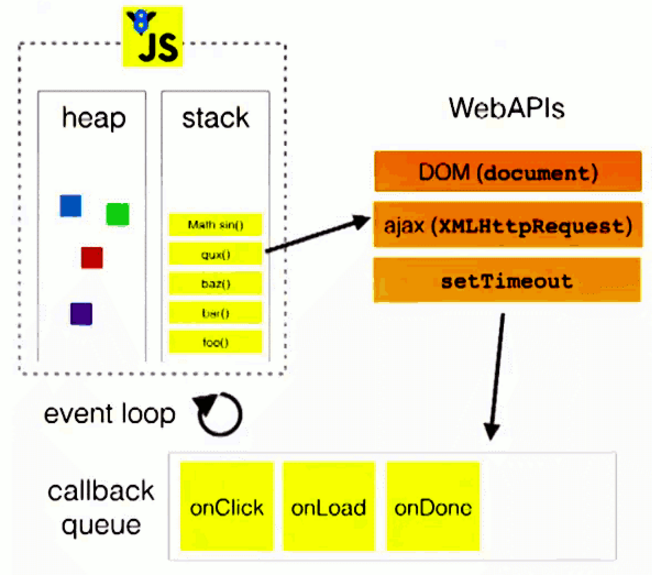

# js高级
# 函数
## 函数
   1. 函数也是对象
   2. 函数具备行为，可以被调用
   3. 用来减少代码量，复用，隔离变量，减少命名污染
## 函数分类
   1. 普通的函数

   2. 构造函数

   3. IIFE(匿名函数自调用)

      作用

       \* 隐藏内部实现

       \* 不污染外部命名空间

   4. 回调函数(事件的回调，定时器的回调)

      1. 什么函数才是回调函数?

       \* 你定义的

       \* 你没有直接调用

       \* 但最终它执行了(在特定条件或时刻)

      2. 常见的回调函数?

       \* DOM事件函数

       \* 定时器函数

       \* ajax回调函数(后面学)

       \* 生命周期回调函数(后面学)

## 函数的this
   1. 理解this：
        - 关键字
        - 变量
   2. **this的指向问题**
        - **函数this不是函数定义的时候决定的**
        - **函数this指向谁看如何调用当前的函数**
   3. this指向分类
        - 函数自调用： window
        - 构造函数(new function): 当前构造函数的实例对象
        - 对象.方法(): 对象本身
        - fun.call/apply(指定的对象): 指定的对象
        

<font color=red>**函数自调用的this永远指向window**</font>

<span style="color:skyblue; font-size:18px">**函数自调用就是指：函数就直接当做函数调用：func(); ,而不是被一个对象调用**</span>

```javascript
function fn1() { 
        console.log(this); //window
        fn3();
    };
    console.log(this); //window
    fn2();
};

function fn3() {
    console.log(this); //window
};

fn1();
```


# 原型

## 什么是原型对象
- 每个函数都有一个prototype属性，该属性指向的是原型对象(显式原型对象)
- 每个实例对象身上都有一个__proto__属性，该属性指向的也是原型对象(隐式原型对象)
- 构造函数的显示原型 === 当前构造函数实例对象的隐式原型对象
- <font color=red>原型对象prototype的本质：普通的Object实例</font>

## 什么是原型链
    1. 查找对象的属性的时候先在自身找，如果自身没有沿着__proto__找原型对象
    2. 如果原型对象上还没有，继续沿着__proto__,直到找到Object的原型对象
    3. 如果还没有找到返回undefined
    4. 原型链： 沿着__proto__查找的这条链就是原型链

```
1. 读取对象的属性值时: 会自动到原型链中查找
2. 设置对象的属性值时: 不会查找原型链, 如果当前对象中没有此属性, 直接添加此属性并设置其值
3. 方法一般定义在原型中, 属性一般通过构造函数定义在对象本身上
```


**Object，Number等构造函数都来自于Function()构造函数，也就是这些构造函数可以看做是Function的实例对象，因此他们里边都有一个__ proto __ 指向Function的prototype。但是值得注意的一点是，Function又能看做是Function的实例，所以Function里边除了有一个prototype外，还有一个 __ proto __同时指向原型对象。也有var Function = new Function();自己被自己new出来。**


上图中，所有构造函数（包括Object和自定义的）的 __ proto __ 都指向Function的prototype，所有函数的prototype的 __ proto __ 指向Object的prototype (构造函数（包括Function）的显式原型对象是Object的实例对象)。也就是说，<font color=red>**除了Object外，其他函数（包括Function）的显式原型对象 的 隐式原型对象都指向Object的显式原型对象。而Object的显式原型对象的隐式原型对象是null。**</font>

## instanceof

A instanceof B：从A出发沿着<span style="color:orange;font-size:20px;font-weight:600"> __ proto __</span> 去找，如果找到了B的prototype，则为True。

**f1 instanceof Foo**

**f1 instanceof Object**

**Function instanceof Object(Function 通过 __proto__到达Function的prototype，再通过__proto__到达Object的prototype)**

**Object instanceof Function**

**Object instanceof Object(Object通过__proto__到达Function的prototype，再通过__proto__到达Object的protorype)**

**Function instanceof Function(Function可以通过__proto__指向自己的prototype)**

**Foo instanceof Function（任何函数都是Function的实例对象）**

**Foo instanceof Object（Foo通过__proto__到Function的prototype，再通过__proto__到Object的prototype）：true**

<font color=green>**f1 instanceof Function、Foo instanceof Foo：false**</font>

```javascript
var A = function () {

}
console.log(A.prototype.n);// undefined
A.prototype.n = 1;
console.log(A.prototype);//很多自带的属性，再增加一个n:1
var b = new A();//this 指针指向原型对象之前的这块的内存

A.prototype = {//原型对象又另外开辟了一块内存
    n: 3,
    m: 4
}//这样一来，把原型对象里边原来自带的一些属性都给搞没了
console.log(A.prototype);//只有n,m和__proto__
var c = new A();
console.log(b.n,b.m,c.n,c.m);//1 undefined 2 3
console.log(b.__proto__,c.__proto__);//两个不一样
```

```javascript
var F = function () {

}
var ff = new F();
Object.prototype.a = function () {
    console.log("a()");
}
Function.prototype.b = function () {
    console.log("b()");
}

var f = new F();

ff.a();//a()

F.a();//a()
F.b();//b()
f.a();//a()
f.b();//f.b() is not a function
```

## **变量提升 & 函数提升**
- js引擎在js代码正式执行之前会做一些预解析的工作
- 找关键字： var， function
- 找到var以后将var后边的变量提前声明，但是不赋值 var a;
- 找到function以后定义对应的函数，也就是说函数在预解析的时候已经定义完毕
- 预解析： 全局预解析，局部预解析
- 注意：
  - 全局预解析在定义<span style="color:orange">函数</span>的时候不关心函数是否被使用，也就是即使定义的函数没被使用，照样会提升函数
  - <font color=red>函数局部预解析的时候如果内部<span style="color:orange">直接function name()定义的函数</span>没有被使用就不会提前定义</font>

```javascript
function f2() {
    console.log("f2");
    function f3() {
        console.log("f3");
    }
}
console.log(1);
f2();
function f4() {
    console.log("f4");
}	

```

**f4在全局中定义，虽然没被调用，但是仍然会被全局预解析，出现在全局的变量对象内；**
<span style="color:orange;font-size:20px">f3在函数内定义，且没被调用，那么在f2的作用域内，函数f3并不会被预解析。**如果f3使用var f3 = function(){}，那么f3还是会被预解析**</span>

```javascript
// console.log(a);//放这里会报错
function f1() {
    // console.log(a);//放这里会报错
    a = 1;
    console.log(a);//1
}
// console.log(a);//这里也会报错
f1();
console.log(a);//1
```

<font color=red size=6>也就是函数内出现的未使用var的、且在全局中也未出现的变量，只有当该函数被调用时才会提到全局进行声明</font>

**注意：**

<font size=6 color=orange>函数内if else内声明的变量会提升到函数最前边，全局内的if else内的变量也会提升到全局的最前边，但是如果没执行到这条分支语句，这个变量就没有被赋值</font>

```javascript
function f(){
    console.log(a);
    console.log(b);
    if(typeof a === "undefined"){
        var a = 3;
    }
    else {
        var b = 4;
    }
}
f();//undefined undefined！！！！！！！！！！！！！！！！！！！！！！！！

console.log(m,n);//undefined undefined
if (1 > 2) {
    var m = 2;
} else {
    var n = 3;
}
console.log(m,n);//undefined 3
```

```javascript
console.log(b);//undefined
if (!(b in window)) {
    var b = 1;
}
console.log(b) // undefined
```

> <font color=orange>if内的属于全局作用域，所以对var b 做了变量提升，所以b in window是true, 那么if就为false，就进入不了if语句内部，就无法给b赋值。</font>

```javascript
var c = 1
function c(c) {
    console.log(c) // 2 undefined
    var c = 3
}
console.log(c);//1
c(2);//c is not a function.
//先把函数c整体提升，然后又提升变量c，但是变量c的声明忽略。
// 接下来就从第一行开始 c = 1;因为前边已经把函数整体提升了（不同于var c =function）,
//那么这里不会再将函数赋给c，所以c就是个普通变量。
```


## 执行上下文

1. 理解： 
    - 执行上下文抽象的概念，代表了代码执行的环境，包含： <span style="color:orange">执行环境，变量对象，this，作用域链</span>
2. 流程：
    - js引擎在js代码正式执行之前会先创建一个执行环境(开发商批的地，工程队施工的环境)
    - 进入该环境以后创建一个变量对象(打地基)，该对象用于收集当前环境下的：函数的参数，函数， 变量，this
        - 找关键字var ，function
    - 确认this的指向
    - 创建作用域链
3. 重点：
    - 执行上下文是动态创建的
    - 尤其是针对函数，每调用一次函数都会创建一次执行上下文
    - 变量对象内存储着基本数据类型的值和引用数据类型的内存地址

```
1. 在全局代码执行前, JS引擎就会创建一个栈结构来存储管理所有的执行上下文
2. 在全局执行上下文(window)确定后, 将其添加到栈中(压栈)
3. 当一个函数被调用时，就会创建函数的上下文。在函数执行上下文创建后, 将其添加到栈中(压栈)
4. 在当前函数执行完后,将栈顶的对象移除(出栈)
5. 当所有的代码执行完后, 栈中只剩下window
6. 压栈压的是执行上下文
```


### 执行上下文理解

```text
1. 执行上下文环境
    - js引擎在js代码正式执行之前会先创建一个执行上下文环境，在！！将要！！调用函数的时候创建函数的执行上下文
    - 分类：
        - 全局执行上下文
        - 局部(函数)执行上下文
        - eval执行上下文

2. 执行上下文的变量对象
    - js引擎进入执行上下文环境之后先创建一个变量对象
    - 该对象用于收集当前执行上下文环境中的： 变量，函数，函数参数，this
    - 确认this的指向
    - 创建作用域链
3. 执行上下文栈
    - 作用： 用于保存执行上下文(变量对象)
    - 遵循规则： 先进后出，后进先出
    - 特点：执行上下文是动态创建的 ---> 针对函数，函数每调用一次就创建一次执行上下文，执行完就销毁！！！！
```

# 作用域

### 作用域分类

 \* 全局作用域

 \* 函数作用域

 \* eval作用域

 \* 没有块作用域(ES6有了)

## 作用域理解
   - 抽象的概念
   - 用来决定代码执行的范围， 变量所属的范围
   - <span style="color:orange">作用域是代码定义的时候决定的，是静态的，**也就是和函数被调用的次数无关**，作用域链都动态创建的。</span>
   - 作用域作用：
        - 隔离变量
        - 规定其之后的作用域链是什么样的，体现： [[scopes]]: 上一级作用域链
### 作用域和执行上下文的区别和联系

1. 区别1
    - 全局作用域之外，每个函数都会创建自己的作用域，作用域在函数定义时就已经确定了。而不是在函数调用时
    - 全局执行上下文环境是在全局作用域确定之后,  js代码马上执行之前创建
    - 函数执行上下文环境是在调用函数时, 函数体代码执行之前创建

2. <span style="color:orange">区别2</span>
    - 作用域是静态的, 只要函数定义好了就一直存在, 且不会再变化
    - 上下文环境是动态的, 调用函数时创建, 函数调用结束时上下文环境就会被释放。
    - 作用域链也是动态创建的。
3. 联系
    - 上下文环境(对象)是从属于所在的作用域       
    - 全局上下文环境==>全局作用域
    - 函数上下文环境==>对应的函数使用域


## 作用域链

   - 作用域链是一个数组结构

   - 该结构内保存的是一个个的变量对象（执行上下文）

   - 作用域链什么时候创建的：在一段js代码正式执行之前创建的，<span style="color:orange">动态的</span>

   - <span style="color:orange">函数的直接调用影响this，但是不影响作用域</span>

     ```javascript
     var a = 2;
     function fn1() {
         var b = 3;
         function fn2() {
             var c = 4;
             console.log(c);
             console.log(b);
             console.log(a);
             // console.log(d);
         }
     
         fn2();
     }
     fn1();
     ```


Global: 是全局的作用域；

closure（fn1）：是fn1的作用域；

local：fn2的作用域；


**在Global中，定义了fn1，fn1内有个属性[scopes]，值是个数组：里边包含的是fn1的上级作用域，可以看到是Global。**


**在Closure(fn1)内则定义了fn2，那么Closure(fn1)内的fn2内也会有个属性[scopes]，值是个数组：里边包含了fn2的上级作用域：Closure(fn1)和Global。**

**！！！！！！！！Local——》Closure(fn1)——》Global就是作用域链，他们可以理解为组成一个数组，每个元素是变量对象。**

<span style="color:orange;font-size:20px; font-weight:600">**Scope内的作用域链和Call Stack内的出入栈执行环境并不是按顺序对应的。**</span>

### 例子

```javascript
console.log(fn);//undefined
var fn = function () {
    console.log(fn);//函数体
}
fn();

var obj = {
    fn2:function () {
        console.log(fn2);//在当前function作用域内找fn2，没有；
        //！！！！然后不是去obj内找，obj没有作用域！！！！
        //所以是去全局作用域内找了，发现没有fn2，所以会报错！！！！
    }
}
obj.fn2();
```

> <font color=red size=4>**这个是非常重要的**</font>
>
> <span style="color:skyblue">**对象内的函数有自己的作用域，但是在这个函数作用域内没找到需要的变量后，接下来并不是要去对象内部找，因为对象没有自己的作用域。**</span>

```javascript
  // 创建全局作用域 ---> 预解析工作 ---> 创建全局的执行上下文 ---> 执行上下文环境 ---> 全局变量对象{a: undefined, this: window， fun:function} ---> 作用域链[全局变量对象]
  var a = 123;
  var b = 'abc'
  // 先定义---> 创建局部作用域---> 函数自身有一个[[scopes]]: 上级作用域链(global)
  function fun() {
    // 创建局部执行上下文 ---> 局部变量对象{a: undefined, c:undefined, fun2: function, this: window} ---> 创建作用域链[局部变量对象, Global]
    var a = 234;
    var c = 345;
    console.log(a);
    console.log(b);
    // fun2函数已经定义了 ---> 创建局部作用域(fun2)---> 函数自身有一个[[scopes]]: 上一级作用域链[fun的变量对象， Global]
    function fun2() {
      // 创建局部执行上下文 ---> 局部变量对象{this: window} ---> 创建作用域链: [fun2的局部变量对象，fun的变量对象， Global]
      console.log(c);
      console.log(d);
    }    
    fun2();
  }

  fun();
```

> **作用域是在代码执行前就已经确定的**，<font color=orange>**例子很重要**</font>
>
> <span style="color:orange">函数的直接调用影响this，但是不影响作用域</span>

```javascript
//面试题1
var scope1 = "Global scope";
function checkScope1() {
    var scope1 = "Local scope";
    function fn() {
        return scope1;
    }
    return fn();
}

console.log(checkScope1());//Local scope

//面试题2
var scope2 = "Global scope";
function checkScope2() {
    var scope2 = "Local scope";
    function fn() {
        return scope2;
    }
    
    return fn;
}

console.log(checkScope2()());//Local scope  如果里边是return this.scope2,结果则是Global scope
//函数的直接调用影响this，但是不影响作用域！！！！！！！！！！！！！！！

var a = 10;
function f1() {
    console.log(a);
}

function f2(){
    var a = 20;
    f1();
}
f1();//10
f2();//10
```

## 作用域链和原型链的区别

<font color=red size=5>**作用域链与原型链的区别：**</font>

- 当访问一个变量时，解释器会先在当前作用域查找标识符，如果没有找到就去父作用域找，作用域链顶端是全局对象window，如果window都没有这个变量则报错。

- 当在对象上访问某属性时，首先会查找当前对象，如果没有就顺着原型链往上找，原型链顶端是null，如果全程都没找到则返一个undefined，而不是报错。

# 闭包

## 闭包形成的条件
   - 函数嵌套
   - 内部函数引用外部函数的局部变量
   - 内部函数被使用，注意： 函数变量提升的时候如果内部函数没有被使用，在预解析的过程中不会定义内部函数

## 什么是闭包
   - 闭包是一个存在内部函数的引用关系

   - 该引用指向的是外部函数的局部变量对象(前提是内部函数使用了外部函数的局部变量)

     

```
注意： 浏览器为了性能，后期将外部函数中不被内部函数使用的变量清除了
```

## 闭包的作用

   - 延长外部函数变量对象的生命周期
   - **使用闭包能够间接的从函数外部访问函数内部的私有变量**

## 闭包的生命周期

1. 产生: 在嵌套内部函数！！定义！！执行完时就产生了(不是在调用)，<span style="color:orange">**伴随着作用域产生**</span>

2. 死亡: 在嵌套的内部函数成为垃圾对象时

## 闭包的优缺点
   - 优点： 延长外部函数变量对象的生命周期
   - 缺点： 延长外部函数变量对象的生命周期(占内存，如果不及时清除容易造成内存溢出，泄漏)
## 使用闭包的时候注意：   
   - 及时清除闭包
   - 让内部的函数成为垃圾对象 ---> 内部函数身上没有指针指向

   

```javascript
// //代码片段一
var name = "The Window";
var object = {
    name: "My Object",
    getNameFunc: function () {
        return function () {
            return this.name;
        };
    }
};
// var result = object.getNameFunc();
// console.log(result());
console.log((object.getNameFunc())());//The window !!!!!!!!!!!!!!!!!
//函数自调用，this永远指向window!!!!!!!!!！！！！！！！！！！！！！！！！！！！
console.log(object.getNameFunc().call(object));

//代码片段二
var name2 = "The Window";
var object2 = {
    name2: "My Object",
    getNameFunc: function () {
        var that = this; // 缓存this
        return function () {
            return that.name2;
        };
    }
};
console.log(object2.getNameFunc()()); //My Object
```


```javascript
function fun(n, o) {
    console.log(o);
    return{fun: function (m) {
        return fun(m,n);
			}
          }
}

var a = fun(0);//console.log(o);undefined  a = {fun:function(m){return fun(m,0);}}
a.fun(1);//return fun(1,0);——》console.log(o);0
a.fun(2);//return fun(2,0):——》0
a.fun(3);//return fun(3,0):——》0

var b = fun(0).fun(1).fun(2).fun(3);//undefined 0 1 2

var c = fun(0).fun(1);
//fun(0)——》undefined,{function}   fun(0).fun(1)={function}.fun(1): return fun(1,0)——》0，{function(m),n=1}
c.fun(2);//={function(m),n=1}.fun(2)：return fun(2,1)——》1,{function(m),n=2}
c.fun(3);//={function(m),n=1}.fun(3)：return fun(3,1)——》1,{function(m),n=3}
```

```javascript
getName();//5 function的提升
function Foo() {
    getName = function () {
        alert(1);
    }
    return this;
}
Foo.getName = function () {
    alert(2);
}
Foo.prototype.getName = function () {
    alert(3);
}

//1.先提升function name(){}
//2.然后再提升var，遇到有重名就忽略
//3.但是，
var getName = function () {
    alert(4);
}
function getName() {
    alert(5);
}

//请写出一下的输出结果
Foo.getName();//2

//在这条语句执行前，getName = function(){}就覆盖了被提升的function getName(){}
getName();//4

//Foo()函数自调用，返回值是 return this，是window。所以这句就相当于window.getName(),
//但是，和全局中的getName()（相当于window.getName()）还是不一样的。因为Foo()内的第一句没有var，那么就是用的全局中的getName(),就修改了全局的getName()
Foo().getName();//1
getName();//1
new Foo.getName();//2  构造函数new的过程其实就是调用call把this绑定到对象身上。Foo.getName.call(obj)s
// 在这个过程中函数内部是会运行计算的。！！！！！！！！！！！！！！！！！！！！
new Foo().getName();//3  == (new Foo()).getName()!!!!!!!!!!!!!!!!!!!!!!
var c = new new Foo().getName();//3 ==new obj.getName()
console.log(c.__proto__.constructor == new Foo().getName);//true
```


# 对象

## 什么是对象?

* 代表现实中的某个事物, 是该事物在编程中的抽象
* 多个数据的集合体(封装体)
* 用于保存多个数据的容器

## 为什么要用对象?

* 便于对多个数据进行统一管理

## 对象的组成

* 属性
    * 代表现实事物的状态数据
    * 由属性名和属性值组成
    * 属性名都是字符串类型, 属性值是任意类型
* 方法
    * 代表现实事物的行为数据
    * 是特别的属性==>属性值是函数

## 如何访问对象内部数据?

* **.属性名: 编码简单, 但有时不能用**

* **['属性名']: 编码麻烦, 但通用**

* ```
  什么时候必须用['属性名']的方式？？
      * 属性名不是合法的标识名
      * 属性名不确定
  ```

## 难点：

 对象最终保存的属性名一定是字符串，如果设置的时候不是字符串，会调用toString()方法将其转换成字符串

```javascript
//{key:value}.toString() 结果是“[object Object]”
```


# js的继承
## 原型链继承

**只能继承“父类”原型对象内的属性**

```javascript
1. 核心思想
    - 子类的原型 成为 父类的实例
    - Child.prototype = new Parent()
2. 注意问题：
    - 以上的写法会导致子类的构造器(constructor)属性丢失
3. 解决问题
    - Child.prototype.constructor = Child
```

1. 方式1: 原型链继承
       - 套路
         1. 定义父类型的构造函数
         2. 给父类型的原型添加方法
         3. 定义子类型的构造函数
         4. 创建父类型的对象赋值给子类型的原型对象
         5. 将子类型原型的构造函数名设置为子类型构造函数名
         6. 给子类型原型添加方法
         7. 创建子类型的对象：可以调用父类型的方法
       - 关键
            - 子类型的原型对象为父类型的一个实例对象
    - <span style="color:orange;font-size:20px;font-weight:600">遗毒</span>
        - 子类型的原型对象中会包含父类型实例化对象的其他属性。
        - 同时也会把原来给子类型的原型中添加的属性给搞丢。所以要在把父类型实例赋值给子类型原型对象后再向子类的原型对象内添加属性。

```javascript
function Person(name, age) {
    this.name = name;
    this.age = age;

}
Person.prototype.showName = function () {
    console.log(this.name);
}

function Child(name, age) {
    this.name = name;
    this.age = age;
}

        //！！！！！！！！！！！！！！！！！！！！！！！！！！！！！！！！！！！！！！！！！
// 原型继承： 子类的原型 成为 父类的实例
//让Child的原型成为Person的一个对象，这样在找变量的过程中，就会在找完Child的原型后去找Person的原型。
//但是，Child原型内的constructor就没了，就要再重新添加回来。

Child.prototype = new Person();
Child.prototype.constructor = Child;


var person1 = new Person("zhangsan",23);
var person2 = new Person("lisi",24);
person2.showName();//lisi

var child1 = new Child("xiaoming",12);
person2.showName.call(child1);//xiaoming
child1.showName();//xiaoming
console.log(child1);
```


## 借用构造函数继承(不是真的继承) 

**把“父类”内的属性全都继承来了**

    1. 核心思想
        - 让父类的方法在子类中执行
    2. 注意问题：
        - 如果父类的方法在子类中直接调用，会导致在window对象身上添加了不必要的属性
    3. 解决问题：
        - 使用call || apply
        - Parent.call(子类的实例对象， 参数)
        - Parent.call(this, 参数)
2. 方式2: 借用构造函数继承(假的)
        1. 套路:
            1. 定义父类型构造函数
            2. 定义子类型构造函数
            3. 在子类型构造函数中调用父类型构造
            2. 关键:
            1. 在子类型构造函数中通用super()调用父类型构造函数

```javascript
    function Person(name, age) {
        this.name = name;
        this.age = age;
        this.f1 = function () {
            console.log(this);
        }
    }
    function Child(name, age, gender) {
        // this.name = name;
        // this.age = age;
        //借用Person中的代码
        // Person(name,age);//这是普通函数自调用，this指向window
        Person.call(this,name,age);
        this.gender = gender;
    }

    var child1 = new Child("zhangsan",21,"女");
    child1.f1();//Child
    var f = child1.f1;
    f();//这样的话输出就是Window了，这就是函数自调用!!!!!!!!!!!!!!!!!!!!!!!!!!!!!!
```


## 组合继承

    1. 核心思想： 原型继承 + 借用构造函数继承

```javascript
//组合继承：
//     原型继承+借用构造函数
function Person(name, age) {
    this.name = name;
    this.age = age;
    this.f1 = function () {
        console.log(this);
    }
}
Person.prototype.getNmae = function () {
    return this.name;
}
function Child(name, age, gender) {
    // this.name = name;
    // this.age = age;
    //借用Person中的代码
    // Person(name,age);//这是普通函数自调用，this指向window
    Person.call(this,name,age);
    this.gender = gender;
}

Child.prototype = new Person();
Child.prototype.constructor = Child;

var child1 = new Child("zhangsan",21,"女");
child1.f1();//Child
var f = child1.f1;
f();//这样的话输出就是Window了，这就是函数自调用!!!!!!!!!!!!!!!!!!!!!!!!!!!!!!
console.log(child1.getNmae());
```

## Object.create()继承


# js事件循环(轮询)机制 

1. js是单线程的 ---> **主线程**

    ​	证明是js是单线程的：不点击alert弹窗的按钮，后续代码就不会执行

    ```javascript
    console.log("程序开始执行");
    console.log("**************");
    alert("____");
    console.log("程序结束执行");
    ```

2. 同步任务 || 异步任务
    - 同步： 1. 阻塞的 2. **同步是没有回调的**
    - 异步： 1. 非阻塞 2. **异步有回调(用来通知当前异步任务执行的结果)**

3. 定时器真的准时吗?不一定

    - 特例：定时器任务的后边有运算量大的代码段

4. 事件轮询机制：
    - 1. js任务都会在js的主线程执行
    - 2. 当开启一个异步任务的时候会交给对应的管理模块去管理

         * <span style="color:orange">定时器模块 : 负责定时器的管理</span>
         * <span style="color:orange">网络请求模块 : 负责服务器请求(常规/Ajax)</span>
         * <span style="color:orange">事件响应模块 : 负责事件的管理</span>
    - 3. 主线程继续执行后续的任务
    - 4. 管理模块接管的对应的回调，它会在恰当的时机将对应的回调放入callback queue中
    - 5. <span style="color:orange">**当主线程上的所有同步任务执行完毕**</span>后会通过 ‘轮询’的方式询问callback queue是否有可执行的回调
    - 6. 假如没有会反复询问
    - 7. 假如有可执行的回调将对应的回调钩到主线程执行

 5. 开发注意事项；

    - <span style="color:skyblue">**不要在定时器任务之后放置运算量大的代码段；**</span>


## 事件循环模块



# JS分线程

- H5规范提供了JS分线程的实现, 取名为: Web Workers

- 相关API
  - Worker: 构造函数, 加载<font color=orange size=4>**分线程**</font>执行的JS文件

    > 注意，<span style="color:skyblue">加载过来的是作为分线程的</span>，`var worker1 = new Worker("./分线程.js");`

  - Worker.prototype.onmessage: 用于接收另一个线程的回调函数

  - Worker.prototype.postMessage: 向另一个线程发送消息

  ```javascript
  //JS主线程
  var worker1 = new Worker("./分线程.js");
  // 监听消息： 接收消息
  worker1.onmessage = function (msg) {// 当接收到分线程发送过来的消息自动调用
      console.log("受到来自分线程的消息："+msg.data);
  }
  
  worker1.postMessage("nba");
  ```

  ```javascript
  //模拟JS分线程
  //分线程中不用再实例出一个web worker对象
  onmessage = function (msg) {
      console.log("收到了来自主线程的数据:"+msg.data);
      var result = msg.data.toUpperCase();
      postMessage(result);
  }
  ```

- 不足
  - <span style="color:orange;font-size:20px;font-weight:600">worker内代码不能操作DOM(更新UI)</span>
  - 不能跨域加载JS
  - 不是每个浏览器都支持这个新特性


# new操作符
[https://www.cnblogs.com/echolun/p/10903290.html](https://www.cnblogs.com/echolun/p/10903290.html)

    1. 创建一个空对象
    2. 将this指向该空对象
    3. 执行函数
    4. 将执行的结果返回

# this Binding

[https://www.cnblogs.com/echolun/p/11962610.html](https://www.cnblogs.com/echolun/p/11962610.html)

# 数组、对象、函数的定义

### 数组定义方式

1. 字面量
2. 构造函数


### 函数的定义方式

1. 字面量：function name(){}
2. 表达式：var f1 = function(){}
3. 构造函数：var f1 = new Function('a','b','return a+b;'); 


### 对象的定义方式

1. 字面量定义：var obj = {};

2. Object构造函数定义：var obj = new Object({});

3. 工厂函数定义：

    ```javascript
    function createObject(name,age){
       var obj = new Object();
       obj.name = name;
       obj.age = age;
       return obj;
    }
    ```

4. 自定义构造函数后用自定义构造函数创建对象

5. 自定义构造函数+原型对象：自定义构造函数, 属性在函数中初始化, 方法添加到原型上

    ```javascript
    function Person(name, age) {
        this.name = name;
        this.age = age;
    }
    Person.prototype.showName = function () {
        console.log(this.name);
    }
    var person1 = new Person('kobe', 43);
    var person2 = new Person('wade', 38);
    console.log(person1 instanceof Person); // true
    person1.showName();
    person2.showName();
    ```

# 一些易错的面试题

1. ```javascript
    var obj = {n:3};
    function fn2(a) {//传参这里a和obj是指向同一个内存地址
        a = {n:4};//在这里又重新给a分配了一块内存
    }
    fn2(obj);
    console.log(obj.n);//3
    ```

2. ```javascript
    var fn = function () {
        console.log(fn);
    }
    fn();//fn函数体
    
    var obj = {
        fn2: function () {
            console.log(fn2);//报错：not defined。当前函数作用域没有，就去外部作用域（全局），也没有
            console.log(this.fn2);//如果能执行到这一步的话，是这个的函数体
        }
    };
    obj.fn2();
    ```

3. ```javascript
    function A(){
    
    }
    A.prototype.n = 1;
    var b = new A();
    A.prototype = {
        n:2,
        m:3
    };//b还在指向原来的原型对象的内存空间，这里是又重新开辟了空间。
    var c = new A();
    
    console.log(b.n,b.m,c.n,c.m);//1,undefined,2,3
    ```