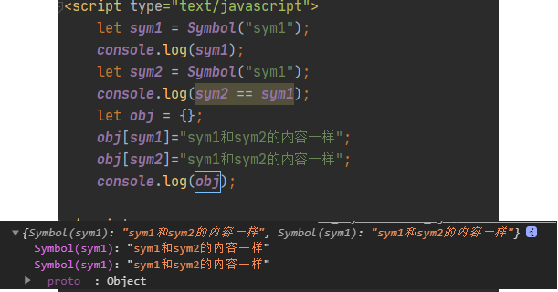

## **理解ES**
1. 全称: ECMAScript
2. js语言的规范
3. 我们用的js是它的实现
4. js的组成
  * ECMAScript(js基础)
  * 扩展-->浏览器端
    * BOM
    * DOM
  * 扩展-->服务器端
    * Node.js
      
## ES5

###  **严格模式**

  * 运行模式: 正常(混杂)模式与严格模式
  * 应用上严格式: 'strict mode';
  * 作用: 
    * 使得Javascript在更严格的条件下运行
    * 消除Javascript语法的一些不合理、不严谨之处，减少一些怪异行为
    * 消除代码运行的一些不安全之处，保证代码运行的安全
    * 需要记住的几个变化
      * 声明定义变量必须用var
      * 禁止自定义的函数中的this关键字指向全局对象
      * 创建eval作用域, 更安全
      * 对象不能有重复的属性
      

### **JSON对象**

  * 作用: 用于在json对象/数组与js对象/数组相互转换
  * JSON.stringify(obj/arr)
      js对象(数组)转换为json对象(数组)
  * JSON.parse(json)
      json对象(数组)转换为js对象(数组)
> 转换为JSON字符串后，数组的元素上不用加引号，数字不用加引号

```javascript
var obj = {name:"zhangsan"};
obj = JSON.stringify(obj);
console.log(obj);
console.log(typeof obj);//string

obj = JSON.parse(obj);
console.log(obj);
console.log(typeof obj);//object

console.log(JSON.parse('[1,2,3]'));//数组
console.log(JSON.parse('{"age":12}'));
console.log(JSON.stringify([{name:"zhangsan"},{age:12}]));//[{"name":"zhangsan"},{"age":12}]
console.log(JSON.parse('[{"name":"zhangsan"},{"age":12}]'));
//数字不用加引号，数组内的元素不用加引号
```

### Object扩展

#### Object.create(proto, [descriptors])

* 作用: <span style="color:orange">以指定对象为新对象的__proto__  ,注意，并不是将指定对象的原型对象作为新对象的原型对象</span>
* 返回值：**一个新对象，**带着指定的原型对象和属性

* 为新的对象指定新的属性, 并对属性进行描述
    - value : 指定值
    - writable : 标识当前属性值是否是可修改的, 默认为false
    - configurable: 标识当前属性是否可以被删除 默认为false
    - enumerable： 标识当前属性是否能用for in 枚举 默认为false

```javascript

   // Shape - 父类(superclass)
    function Shape() {
        this.x = 0;
        this.y = 0;
    }

    // 父类的方法
    Shape.prototype.move = function(x, y) {
        this.x += x;
        this.y += y;
        console.info('Shape moved.');
    };

    // Rectangle - 子类(subclass)
    function Rectangle() {
        Shape.call(this); // call super constructor.
    }

    // 子类续承父类
	//！！！！！！！！！！！！！！！！！！！！！！！！！！！！！！！！！！！！！！！！！！！！！！！！！！！！！！！
    Rectangle.prototype = Object.create(Shape.prototype);//在proto中找不到move,要再找一级（无法理解？？？？？？）。且proto中不含父类的基本属性
	 ////因为Object.create(obj)就是将obj作为新对象的__proto__，那么这里就是将Shape.prototype作为Rectangle.prototype的__proto__，所以要再找一级。
	////因为返回值是一个带着指定的原型对象和属性的！！！！新对象！！！！！，所以也就是说Rectangle.prototype被重新赋值了，里边原来的属性都没了，所以后边要重新指定constructor，而且要向Rectangle.prototype内添加属性的话，也要在Object.create之后再进行。
    // Rectangle.prototype = new Shape();//在proto中找不到move,要再找一级。且proto中含有父类的基本属性（可以理解）
    // Rectangle.prototype = Shape.prototype;//直接在proto中就有move了（可以理解）

    Rectangle.prototype.constructor = Rectangle;

    var rect = new Rectangle();

    console.dir(Shape);
    console.dir(Rectangle);
    console.dir(rect);

    console.log('Is rect an instance of Rectangle?',
        rect instanceof Rectangle); // true
    console.log('Is rect an instance of Shape?',
        rect instanceof Shape); // true
    rect.move(1, 1); // Outputs, 'Shape moved.'


	var obj = {
        name: "zhangsan",
        getNmae: function () {
            return name;
        }
    };

    var obj2 = Object.create(obj,{
        age:{value:23,writable:true,enumerable:true},
        gender:{value:"男"},
        name:{value:"lisi",configurable:true,enumerable:true}
    });

    console.log(obj2);
    console.log(obj2.name);//lisi
    console.log(obj2.__proto__.name);//zhangsan
    obj2.age = 1;//默认不能修改，要加writable属性
    console.log(obj2);

    for (var obj2Key in obj2) {//for in枚举的时候还会把原型内的属性列出来
        if (obj2.hasOwnProperty(obj2Key)){
            console.log(obj2Key);
        }

    }

    delete obj2.name;//configurable可以删除
    console.log(obj2);


```

#### Object.defineProperties(object, descriptors)

* 作用: 为指定对象定义扩展多个属性
* get ：用来获取当前属性值的回调函数
* set ：修改当前属性值时触发的回调函数，并且实参即为修改后的值
* 存取器属性：setter,getter一个用来存值，一个用来取值


### Array扩展

  * Array.prototype.indexOf(value) : 得到值在数组中的第一个下标
  * Array.prototype.lastIndexOf(value) : 得到值在数组中的最后一个下标
  * **Array.prototype.forEach(function(item, index){}) : 遍历数组**
  * **Array.prototype.map(function(item, index){}) : 遍历数组返回一个新的数组**
  * **Array.prototype.filter(function(item, index){}) : 遍历过滤出一个子数组**

### **Function扩展**

  * Function.prototype.bind(obj)
      * 将函数内的this绑定为obj, 并将函数返回
  * 面试题: 区别bind()与call()和apply()?
      * fn.bind(obj) : 指定函数中的this, **并返回函数**
      * fn.call(obj) : 指定函数中的this,**并调用函数**
      
### Date扩展

  * Date.now() : 得到当前时间值

## ES6
### <font color=orange>**let&const**</font>

  * let/const
  * 块作用域
  * 没有变量提升
  * 不能重复定义
  * 值不可变

#### let

1. 作用:
   
    * 与var类似, 用于声明一个变量
    
2. 变量提升
    - 全局变量提升
      - <span style="color:orange"><span style="color:red;font-size:20px;font-weight:bolder">会创建一个变量对象（script）</span>，位于global变量对象的上边，**用于收集全局作用域下let定义的变量，全局作用域内let定义的变量不会出现在global内，而是出现在script内。**但是没有赋值。</span>
    - 局部变量提升
      - 会将var let定义的变量都放在当前函数的变量对象内.
      - for循环中使用let，也会有单独的作用域，在浏览器中显示为"block"
    - let与var变量提升的区别
  - let提升的变量在赋值前不允许被使用
    
    ```javascript
    // console.log(i);//报错：cannot access 'i' before initialization
    // console.log(j);//报错：cannot access 'j' before initialization
    // console.log(x);////报错：cannot access 'j' before initialization
    console.log(y);//undefined
    let i = 2;
    const j = 3;
    let x;
    var y;
    console.log(i);//2
    console.log(j);//3
    console.log(x);//undefined
    ```
    
    > 前三个报错都不是报的not defined错误，说明还是进行了预处理和变量提升，只是不能使用
    
3. <span style="color:orange">**特点:**</span>

* **在块作用域内有效（可以用于解决回调函数中i的问题｛每一个循环都有自己的作用域｝，之前的解决办法1、加index；2、用闭包解决｛虽然外部函数已经返回了，但是内部函数还在指向外部函数的那块内存｝）**
* 不能重复声明
* 会预处理，有变量提升， 但是不能提前使用提升的变量

4. 应用:

* 循环遍历加监听
* 使用let取代var是趋势

```javascript
console.log(a);//undefined
var a = 123;
var a = 234;
// let a = 345;//也不行，还会报错，重复声明
console.log(a);
// console.log(userName);//
let userName;
userName = "zhangsan";
// let userName = "lisi";//报错：Identifier 'userName' has already been declared
console.log(userName);

function f1() {
    //！！！！！！！！！！！！！！！！！！！！！！！！！！！！！！！！！！！！！！！
    //f1前的作用域链是script------global,(可以去浏览器求证)
    var age = 21;
    let userName = "lisi";
    // console.log(userName);
    function f2() {
        
    }
}
f1();

console.log("_________________________");
var btns = document.querySelectorAll("button");
for(let i=0;i<btns.length;i++){
    btns[i].onclick = function () {
        console.log(i);
    }
}
```

#### const

1. 作用:

   * 定义一个常量

2. 特点:

   * 不能修改
   * 其它特点同let
   * <font color=red>**实际上，const并不是保证变量的值不变，而是变量指向的那个内存值不得改动（对于基本数据类型，就是数值不能改变，对于对象类型，则是指向的那块内存地址不得改变，内存内的值还是可以改的）**</font>

   ```javascript
   let obj1 = {name:"zhangsan",age:11};
   const OBJ = obj1;
   OBJ.name = "lisi";
   console.log(obj1.name);
   ```

3. 应用:

   * 保存不用改变的数据


### **变量的解构赋值**

  1. 理解:

* 从对象或数组中提取数据, 并赋值给变量(多个)

   2. 对象的解构赋值
  * let {n, a} = {n:'tom', a:12}//<font color=orange>**变量名必须和对象属性完全一样，而且也可以只取一个属性**</font>
    <font color=skyblue>**n,a相当于是在全局中声明的变量**</font>
   3. 数组的解构赋值
  *  let [a,b,,,e] = [1, 'atguigu'，2，3，4];//<font color=orange>**用逗号跳过不想取的数组元素，后边的可以不管**</font>
   4. 用途
        * 给多个形参赋值
        * **function fun({name,age}){}——》fun(obj)**    //obj的属性必须为name age
        * **function fun([a,b,c]){}——》fun(arr);**

```javascript
console.log("------------对象的解构赋值--------------");
var obj = {name:"zhangsan",age:23};
var {name,age} = obj;//不能用[name,age] = {}
var {na,ag} = obj;
console.log(na,ag);//undefined undefined 变量名和属性名要一样
console.log(name,age);


let obj2 = {name2:"lisi",age2:12};
let {name2} = obj2;//变量名和属性名要一样，而且可以单独解构赋值
console.log(name2);
// let {name2,age2} = obj2;//报错： Identifier 'name2' has already been declared
let {age2} = obj2;
console.log(name2,age2);

console.log("------------数组的解构赋值-------------");
let arr = [0,1,2,3,4,5];
let [a,b,,,e] = arr;//！！！！！！！！！跳过的数组元素用逗号隔开，后边的可以不管！！！！！！！！！！！
console.log(a,b,e);
```

### 各种数据类型的扩展

#### 字符串的扩展

* **模板字符串** 
  * 作用: 简化字符串的拼接
  * <span style="color:orange">**模板字符串必须用``**(这是键盘左上角的点，不是单引号)</span>
  * <span style="color:orange">**变化的部分使用${xxx}定义**</span>
* includes(str) : 判断是否包含指定的字符串
* startsWith(str) : 判断是否以指定字符串开头
* endsWith(str) : 判断是否以指定字符串结尾
* repeat(count) : 重复指定次数

#### 对象的扩展

* **简化的对象写法**
  ```javascript
  let name = 'Tom';
  let age = 12;
  let person = {
      name,
      age,
      setName (name) {
          this.name = name;
      }
  };
  ```
  
* Object.assign(target, source1, source2..) : 将源对象的属性复制到目标对象上，相同属性会被后边的覆盖

* Object.is(v1, v2) : 判断2个数据是否完全相等，还不太会用

```javascript
console.log(0 === -0);//true
console.log(NaN === NaN);//false

console.log(Object.is(0,-0));//false
console.log(Object.is(NaN,NaN));//true
console.log(2 === parseInt('2.32'));//true
console.log(Object.is(2, parseInt('2.32')));//true
```

* __proto__属性 : 隐式原型属性

> <font color=orange>**操作 对象的属性的优先级高于给对象本身赋值**</font>
>
> ```javascript
> a.x = a = {n:2};//先是a.x = {n:2},再是a={n:2}
> ```

#### 数组的扩展

* Array.from(v) : 将伪数组对象或可遍历对象转换为真数组

```javascript
let btns = document.getElementsByTagName('button');
console.log(btns);//是一个伪数组,不能使用forEach
console.log(Array.from(btns));
Array.from(btns).forEach(function (item,index) {
    console.log(index,item);
})
```

* Array.of(v1, v2, v3) : 将一系列值转换成数组

```javascript
console.log(Array.of(1,'asd',{a:1}));
```

* find(function(value, index, arr){return true}) : 找出第一个满足条件返回true的**元素**

```javascript
let result = [1,2,3,4,5].find(function (item,index) {
    return index >= 1;
});
```

* findIndex(function(value, index, arr){return true}) : 找出第一个满足条件返回true的**元素下标**


##### 伪数组

​	伪数组：有length属性，可以通过下标获取元素，但是没有数组的一般方法，如push,shift等。arguments就是伪数组

#### 数值的扩展

- 二进制用0b, 八进制用0o，十六进制用0x

```
console.log(0b100);//二进制表示  10
console.log(0o10);//八进制表示   8 
console.log(0x10);//十六进制    16
```

- Number.isFinite(i) : 判断是否是有限大的数

- Number.isNaN(i) : 判断是否是NaN

- Number.isInteger(i) : 判断是否是整数

- Number.parseInt(str) : 将字符串转换为对应的数值

- Math.trunc(i) : 直接去除小数部分


### **箭头函数**

* 用来定义匿名函数

* 基本语法:
  * 没有参数: () => console.log('xxxx')
  * 一个参数: i => i+2
  * 大于一个参数: (i,j) => i+j
  * 函数体不用大括号: 默认返回结果
  
  > <font color=orange size=4>**当函数体只有一条语句，且省略掉函数体的大括号时，箭头函数的返回值就是 这条语句的返回值或者表达式结果，就相当于自动在这条语句前边加了个return**</font>
  
  ```javascript
  //！！！！！！！！！！！！！！！！！！！！！！！！！！！！！！！！！！！！！
  //当函数体只有一条语句，且省略掉函数体的大括号时，箭头函数的返回值就是 这条语句的返回值或者表达式结果
  //当只有一条语句且没省略大括号时，那么就像正常函数体一样。
  //也就是说：只有一条语句且不加大括号时，就相当于自动在这条语句前边加了个return!!!!!!!!!!!!!!!!!
  function f1() {
      return "这是f1()的返回值";
  }
  var f = ()=>f1();
  console.log(f());//这是f1()的返回值
  
  console.log((()=>console.log("后边的undefined是我consl的return值"))());
  ```
  
  * 函数体如果有多个语句, 需要用{}包围
  
* 使用场景: 多用来定义回调函数

* 箭头函数的特点：
      1、简洁
      2、箭头函数没有自己的this，箭头函数的this不是调用的时候决定的，而是**在定义的时候处在的上下文对象就是它的this**
      **3、扩展理解**： **箭头函数的this看外层的是否有函数**，
          **如果有，外层函数的this就是内部箭头函数的this，**
          **如果没有，则this是window。**

  ​		其实就是继承了外层的this

  ​	**4、<span style="color:orange">不能将箭头函数当做构造函数使用</span>**

  ​	5、<span style="color:orange;font-size:18px;font-weight:bold">一旦箭头函数的this绑定成功就不能再通过其他显式绑定的方法更改了。但是可以通过改变箭头函数外部函数this指向来间接改变箭头函数this。</span>
  
  ```javascript
  console.log("------------------箭头函数this的指向问题---------------");
  let btn1 = document.getElementById("btn1");
  let btn2 = document.getElementById("btn2");
  // btn1.onclick = function () {
  //     console.log(this);
  // }//<button id="btn1">点击按钮1</button>
  
  // btn2.onclick = ()=>console.log(this);//window
  
  let obj1 = {
      name: "zhangsan",
      test(){
          console.log("test()的this是谁呢：",this);
          btn1.onclick = ()=>{console.log(this);};
      }
  }
  console.log("----------绑到obj1上-----------");
  obj1.test();//obj，点击btn1也是obj
  //用call来换一下this
  console.log("-----------用call给换了this----------");
  obj1.test.call(this);//window,点击btn1也是window
  
  //再用箭头函数换this
  console.log("-----------再用箭头函数换this------------");
  let obj2 = {
      name: "zhangsan",
      test:()=>{
          console.log("test()的this是谁呢：",this);//window
          btn2.onclick = ()=>{console.log(this);};//window
      }
  }
  obj2.test();//window！！！！！！！！！！！！！！！！！！！！！！！！！
  
  
  
  //但是！！！！！
  function Animal(name,age) {
      this.name = name;
      this.age = age;
      this.getName = () => {
          console.log(this);
          return this.name;
      }
      console.log(this);
  }
  console.dir(Animal);
  let an1 = new Animal("cat",1);
  console.log(an1);
  console.dir(an1);
  //！！！！！！！！！！！！！！！！！！！！！！！！！！！！！！！！！！
  //其实可以这样理解，在这个构造函数用来new一个对象时，构造函数内console.log(this)的this就是obj，那么箭头函数从构造函数继承来的this当然也不是window了。
  console.log(an1.getName());//虽然是箭头函数，但this还是Obj
  an1.getName.call(window);//这是输出的this还是obj，这是因为一旦箭头函数的this绑定成功就不能再通过其他显式绑定的方法更改了。但是可以通过改变箭头函数外部函数this指向来间接改变箭头函数this。
  ```

### 默认形参


### 三点运算符

* **rest(可变)参数**

  * 通过形参左侧的...来表达, 取代arguments的使用，**且只能放在最右边**
  * <span style="color:orange">默认形参和三点运算符一起用的话，还是三点运算符在最右边</span>

* **扩展运算符(...name)**

  * **可以依次分解出数组，不能直接遍历对象**

  * ```javascript
    let arr1 = [1,2,3];
    let arr2 = [0,4,5];
    arr2.splice(1,0,...arr1);
    console.log(arr2);//0,1,2,3,4,5
    ```


### symbol

>  基本数据类型：六种：String Number Boolean Null Undefined + Symbol

>  typeof的返回值：七种：string number boolean undefined object function symbol

前言：ES5中对象的属性名都是字符串，容易造成重名、误覆盖修改等，污染环境。例如：<span style="color:red;font-size:20px;font-weight:bold">obj={}; str1 = "name"; str2="name"; 有可能我给obj内用str1添加了name属性obj[str1]="name1"，但是别人不知道这个属性名已经有了，又用obj[str2]=“拉布拉多”把我之前的给覆盖了。但是用Symbol就可以避免这个问题。即使有sym1 = Symbol("name"); sym2 = Symbol("name"); 并且分别进行了obj[sym1]="name1";obj[sym2]="拉布拉多"赋值，但是在Obj对象内，这两个属性是同时存在的。因为sym1 == sym2 为false</span>

Symbol：

- 概念：ES6中的添加了一种原始数据类型symbol(已有的原始数据类型：String, Number, boolean, null, undefined, 对象)

-  特点：

  - Symbol属性对应的<font color=skyblue>**值是唯一的**</font>，解决命名冲突问题
  - Symbol值不能与其他数据进行计算，包括同字符串拼接
  - for in, for of遍历时不会遍历symbol属性。 

- 使用：<font color=skyblue>**(没用new关键字)**</font>

  1. 调用Symbol函数得到symbol值
           let symbol = Symbol();
           let obj = {};
           obj[symbol] = 'hello';

  2. 传参标识
           let symbol = Symbol('one');
           let symbol2 = Symbol('two');
           console.log(symbol);// Symbol('one')
           console.log(symbol2);// Symbol('two')

  3. 内置Symbol值

     - 除了定义自己使用的Symbol值以外，ES6还提供了11个内置的Symbol值，指向语言内部使用的方法。

     - Symbol.iterator

     - 对象的Symbol.iterator属性，指向该对象的默认遍历器方法(后边讲)


### iterator遍历器

- 概念： iterator 是一种接口机制，为各种不同的数据结构提供统一的访问机制
- 作用：
  1. 为各种数据结构，提供一个统一的、简便的访问接口；
  2. 使得数据结构的成员能够按某种次序排列
  3. ES6创造了一种新的遍历命令 for...of循环，<font color=orange>**Iterator接口主要供for...of消费**</font>。

- 工作原理：
    - 创建一个指针对象(遍历器对象)，指向数据结构的起始位置。
    - 第一次调用next方法，指针自动指向数据结构的第一个成员
    - 接下来不断调用next方法，指针会一直往后移动，直到指向最后一个成员
    - 每调用next方法返回的是一个包含value和done的对象，{value: 当前成员的值,done: 布尔值}
      - value表示当前成员的值，done对应的布尔值表示当前的数据的结构是否遍历结束。
      - 当遍历结束的时候返回的value值是undefined，done值为true

- 原生具备iterator接口的数据(可用for of遍历)
  1. Array
  2. arguments
  3. set容器
  4. map容器
  5. String

```javascript
function iteratorUtil() {
    console.log(`iteratorUtil方法被${this}调用了`);
    let index = 0;
    let that = this;
    if (that instanceof Array){
        return {
            next: function () {
                return {
                    value: that[index++],
                    done: index>that.length?true:false
                }
            }
        }
    }
    else{
        let keys = Object.keys(that);
        return {
            next: function () {
                return {
                    value: that[keys[index++]],
                    done: index>keys.length?true:false
                }
            }
        }
    }
 
}

Array.prototype[Symbol.iterator] = iteratorUtil;
let arr = [1,2,3,4,5];
console.log(arr);
for (let number of arr) {
    console.log(number);
}
console.log(...arr);

console.log("------------对对象增加forof-----------");
Object.prototype[Symbol.iterator] = iteratorUtil;
let obj = {
    name:"zhangsan",
    age:12
};
console.log(obj);

for (let number of obj) {
    console.log(number);
}
```

### class（待补充）

1. 通过 class 定义类/实现类的继承
2. 在类中通过 constructor 定义构造方法
3. 通过new来创建类的实例
4. 通过 extends 来实现类的继承
5. 通过super调用父类的构造方法
6. 重写从父类中继承的一般方法
7. <font color=orange>**js中没有方法重载(方法名相同, 但参数不同)的语法**</font>

**注意：**

> 给类名对象（Person）添加：
>
> - 属性：static
> - 方法：static
> - 原型对象上添加属性：
> - 原型对象上添加方法：和constructor外和constructor平级的直接函数名（showInfo(){}）
>
> 添加到实例对象上的：
>
> - 属性：1、constructor外，直接属性名=***；2、constructor内this.属性名
> - 方法：constructor内this.方法名
> - 实例对象的隐式原型就是class的显示原型。这个class就可以看做一个构造函数

- class内的static属性是属于class对象的，如属于Person对象，并不属于实例对象

- class内的不带var let的属性在目前看来相当于在constructor内this.属性

- constructor内的this.属性名/方法名是在对象实例内

- 和constructor平级的方法是在原型对象内（暂时不知属性是什么样）

- 类的继承中，子类constructor内super()效果相当于

  Child.prototype = Object.create(Person.prototype);
  Child.prototype.constructor = Child; 

  并且在function Child(...values){Person.call(this,...values);}
  只不过constructor那里，用class的话显示class xxx，用function构造函数的话，显示f xxx

```javascript
console.log("-----------定义类：class----------");
//定义一个Person类
class Person{
    // 静态资源修饰符，使用static可以给 类对象 自身添加属性=Person.num
    // 有待继续学习static
    static num = 123;

    gender = "女";//前边不能加var let,目前来看相当于在constructor内this.gender

    // 类的构造方法
    constructor(name, age){
        console.log('--- Person的constructor() ---');
        //出现在实例对象内！！！！！！！！！！！！！！！！！！！！！
        this.name = name;
        this.age = age;
        this.getNmae = ()=> this.name;
    }
    // 类的一般方法，会出现在原型对象内！！！！！！！！！！！！！！！！
    showInfo(){
        console.log(this.name, this.age);
    }
}
console.dir(Person);

Person.msg = "Person自身的属性";
console.log(Person.msg);
console.log(Person.num);

//使用类
let person1 = new Person("zhangsan",12);
console.log(person1);
person1.showInfo();

console.log("-----------类的继承：extends-----------");
//定义子类继承父类
//！！！！！！！！！！！！目前的一个发现！！！！！！！！！！！！！
//目前来看，效果相当于Child.prototype = Object.create(Person.prototype);
// Child.prototype.constructor = Child; 并且在function Child(...values){Person.call(this,...values);}
// 只不过constructor那里，用class的话显示class xxx，用function构造函数的话，显示f xxx
class Child extends Person{
    constructor(name,age,sex) {
        //super做的事情：1、调用父类的构造方法；2、改变父类构造方法的this指向为子类实例
        super(name,age);
        console.log("-----Child的constructor()----");
        this.sex = sex;
    }

}

let child1 = new Child("xiaoming",12,"男");
console.log(child1);
console.log(child1.getNmae());//xiaoming
child1.showInfo();//xiaoming 12

console.log("-------------另外一个子类-------------");
class Childd extends Person{
    constructor(name,age,sex) {
        //super做的事情：1、调用父类的构造方法；2、改变父类构造方法的this指向为子类实例
        super(name,age);
        console.log("-----Child的constructor()----");
        this.sex = sex;
    }
    //父类的方法重写：当父类原型的方法不能满足子类实例需求的时候
    //这个showInfo实在子类的原型对象内，父类的那个showInfo也还是在的，只不过是在原型对象的原型对象内
    showInfo() {
        console.log(this.name,this.age,this.sex);
    }
    
}

let child2 = new Childd("xiaoming",12,"男");
console.log(child2);
console.log(child2.getNmae());//xiaoming
child2.showInfo();//xiaoming 12 男
```

### set/Map容器结构

  * 容器: 能保存多个数据的对象, 同时必须具备操作内部数据的方法
  * **Set的特点**: 保存多个value, **value是不重复** ====>数组元素去重
  * **Map的特点**: 保存多个key--value, **key是不重复**, value是可以重复的
  * API
    * Set()/Set(arr) //arr是一维数组
    * add(value)//返回add后的Set
    * delete(value)//返回是否成功delete
    * clear();
    * has(value)
    * size
    * 
    * Map()/Map(arr) //arr是二维数组
    * set(key, value)
    * delete(key)
    * clear()
    * has(key)
    * size
    
```javascript
console.log("------------Set-----------");
let arr = [1,2,3,4,1,2];
let setArr = new Set(arr);
console.log(setArr);
console.log(setArr.add(5),setArr);
console.log(setArr.delete(1),setArr);
console.log(setArr.size);
console.log(setArr.clear());

let obj = {a:"a1",b:"b2"};
// let setObj = new Set(obj);//报错 object is not iterable (cannot read property Symbol(Symbol.iterator))
// console.log(setObj);

console.log("------------Map-----------");
let arr1 = [[3,4,5],["a","b","c"]];
let mapArr = new Map(arr1);
console.log(mapArr);//3=>4,"a"=>"b",没有后边的内容了
// console.log(new Map(obj));//报错 object is not iterable (cannot read property Symbol(Symbol.iterator))
```

### for--of循环 

**for--of可以的，三点运算符也可以（至少下面这几种都是可以的）**

- 遍历数组

- 遍历Set容器

- 遍历Map容器

- 遍历字符串

- 遍历伪数组


### for--in循环（不限于ES6）

```javascript
let obj = {name:"zhangsan",age:12};
let arr = [1,2,3];

for (let objKey in obj) {
    console.log(objKey);//打印对象的key
}
for (let arrKey in arr) {
    console.log(arrKey);//打印数组的下标
}
```

  

### **Promise**(待补充)

  * 解决`回调地狱`(回调函数的层层嵌套, 编码是不断向右扩展, 阅读性很差)
  * 能以同步编码的方式实现异步调用
  * 在es6之前原生的js中是没这种实现的, 一些第三方框架(jQuery)实现了promise
  * ES6中定义实现API: 
    ```javascript
    // 1. 创建promise对象
    var promise = new Promise(function(resolve, reject){ 
      // 做异步的操作 
      if(成功) { // 调用成功的回调
        resolve(result); 
      } else { // 调用失败的回调
        reject(errorMsg); 
      } 
    }) 
    // 2. 调用promise对象的then()
    promise.then(function(
      result => console.log(result), 
      errorMsg => alert(errorMsg)
    ))
    ```
7. **class类**
  * 用 class 定义一类
  * 用 constructor() 定义构造方法(相当于构造函数)
  * 一般方法: xxx () {}
  * 用extends来定义子类
  * 用super()来父类的构造方法
  * 子类方法自定义: 将从父类中继承来的方法重新实现一遍
  * **js中没有方法重载(方法名相同, 但参数不同)的语法**

8. **模块化(后面讲)**

## ES7
* 指数运算符(幂): **
* Array.prototype.includes(value) : 判断数组中是否包含指定value，只用于单个元素
* <font color=orange>**区别方法的2种称谓**</font>
  * 静态(工具)方法
    * Fun.xxx = function(){}
  * 实例方法
    * 所有实例对象 : Fun.prototype.xxx = function(){} //xxx针对Fun的所有实例对象
    * 某个实例对象 : fun.xxx = function(){} //xxx只是针对fun对象


# 自定义数据类型检测

- typeof 数据类型检测：Number String Boolean undefined Symbol Funtion Object
- 自定义数据类型检测：Number String Boolean undefined  Symbol Funtion  Null Array

```javascript
let obj1 = {name:"zhangsan",age:12};
console.log(obj1.toString());//[object Object]
let arr1 = [1,2,3,4];//数组重写了Object原型中的toString()
console.log(arr1.toString());//1,2,3,4
console.log(Object.prototype.toString.call(arr1));//[object Array]
let num1 = 123;
console.log(Object.prototype.toString.call(num1));//[object Number]
function Person() {

}
let person1 = new Person();
console.log(person1.toString());//[object Object]
console.log(Object.prototype.toString.call(person1));//[object Object]
```

```javascript
function checkType(target) {
    console.log(Object.prototype.toString.call(target).slice(8,-1));
}
checkType(123);//Number
checkType(function () {

});//Function
checkType(null);//null
checkType(NaN);//Number
checkType([1,2,3]);//Array
checkType(person1);//Object
```

# 自定义对象数组深拷贝

```javascript
//只针对对象和数组的深拷贝，基本数据类型则直接输出（基本数据类型没有深浅之分）
function deepClone(target) {
    let result;
    let targetType = checkTargetType(target);
    if (targetType == "Array"){
        result = [];
    }
    else if (targetType == "Object"){
        result = {};
    }
    else{
        return target;
    }
    //for--in既能遍历对象，又能遍历数组！！！！！！！！
    for (let targetKey in target) {
        result[targetKey] = deepClone(target[targetKey]);
    }
    return result;
}

obj = {name:"儿子",age:12,birthday:{month:11,day:30},parent:["爸爸","妈妈"]};
obj2 = deepClone(obj);
console.log(obj2);//拷贝成功，但是为什么下边才改了的属性，在这里输出的就是被改了的呢？？？？？？？？
obj2.parent = ["马云","董明珠"];
console.log(obj);//没受影响
```


